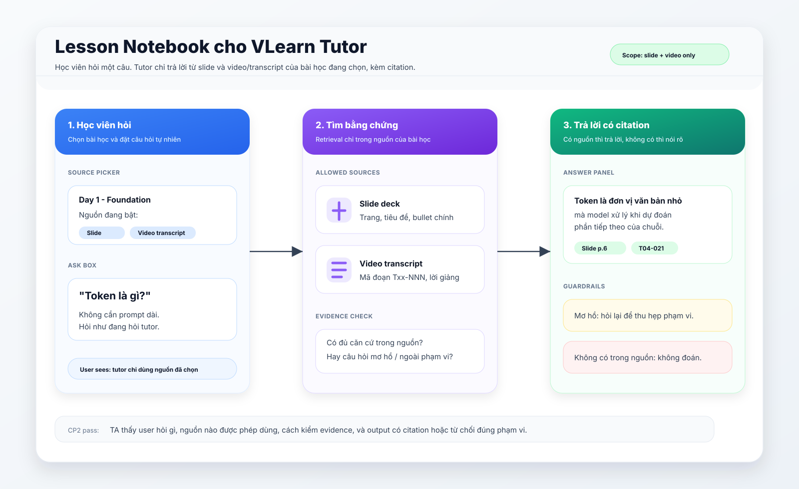
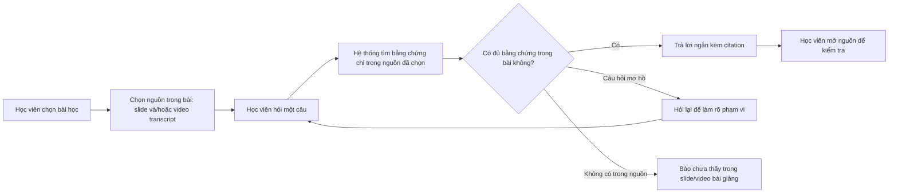

# CP2 Flow - Lesson Notebook cho VLearn

## Mục tiêu CP2

Prototype đi theo ý tưởng **NotebookLM mini cho VLearn**: học viên hỏi một câu, hệ thống chỉ được trả lời từ corpus tích lũy từ **Day01 đến bài học hiện tại**, gồm **slide** và **video/transcript bài giảng**. Khi có Day06, Day06 được bổ sung vào corpus.

Ở CP2 chưa cần AI chạy thật. Artifact này dùng để TA thấy flow chính, phạm vi nguồn, và các nhánh xử lý trước khi nhóm build.

Bản flowchart tĩnh để show nhanh: [`cp2-flow.svg`](cp2-flow.svg).

## Luồng chính

## Màn hình cần mock

1. **Source picker**
   - Hiển thị phạm vi bài học: Day01 → bài hiện tại.
   - Bật/tắt nguồn: slide, video/transcript.
   - Hiển thị rõ: "Tutor chỉ trả lời từ các nguồn đang chọn".

2. **Ask box**
   - Học viên nhập một câu hỏi về nội dung từ Day01 đến bài hiện tại.
   - Ví dụ: "Token là gì?", "Vì sao model lại dự đoán từ tiếp theo?", "Attention giúp gì?"

3. **Evidence panel**
   - Hiển thị các đoạn nguồn tìm được từ slide/transcript.
   - Mỗi đoạn có nhãn nguồn: `Slide p.X` hoặc `Video Txx-NNN`.

4. **Answer panel**
   - Nếu đủ căn cứ: câu trả lời ngắn, có citation ngay cạnh ý chính.
   - Nếu thiếu căn cứ: hỏi lại hoặc nói rõ chưa thấy trong nguồn bài giảng.
   - Không dùng web, không trả lời bằng kiến thức ngoài bài.

## Kịch bản demo CP2

### Case 1 - Có trong nguồn bài giảng

- Bài học: Day 1 - Foundation: cách LLM hoạt động.
- Nguồn bật: slide + transcript video.
- Câu hỏi: "Token là gì?"
- Hành vi mong muốn:
  - Hệ thống tìm đoạn nguồn nói về token/tokenization.
  - Tutor trả lời ngắn theo nội dung bài.
  - Câu trả lời có citation để mở lại slide hoặc transcript.

### Case 2 - Câu hỏi mơ hồ

- Bài học: Day 1 - Foundation: cách LLM hoạt động.
- Nguồn bật: slide + transcript video.
- Câu hỏi: "Cái này dùng sao?"
- Hành vi mong muốn:
  - Hệ thống không đoán "cái này" là gì.
  - Tutor hỏi lại một câu để thu hẹp phạm vi.
  - Ví dụ: "Bạn đang hỏi token, embedding, attention hay bước dự đoán từ tiếp theo?"

### Case 3 - Không có trong nguồn đã chọn

- Bài học: Day 1 - Foundation: cách LLM hoạt động.
- Nguồn bật: slide + transcript video.
- Câu hỏi: "Deadline nộp lab 2 là khi nào?"
- Hành vi mong muốn:
  - Hệ thống không tự đoán deadline.
  - Tutor nói rõ: "Mình chưa thấy thông tin này trong slide/video bài giảng đang chọn."
  - Gợi ý hỏi trợ lý Discord/TA hoặc chọn nguồn khác.

## Tiêu chí pass cho CP2

- Người xem hiểu đây là tutor dạng source-grounded, giống NotebookLM cho một bài học.
- Flow thể hiện rõ nguồn duy nhất được dùng: slide và video/transcript bài giảng.
- Có đủ 3 nhánh: trả lời có citation, hỏi lại khi mơ hồ, từ chối khi không có trong nguồn.
- Flow khớp với lát cắt CP1 trong `canvas.md`.
