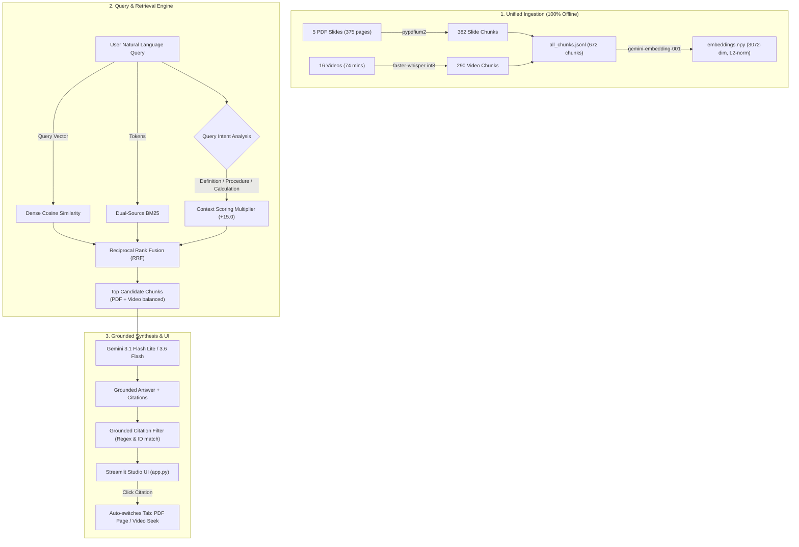

# VLearn NotebookLM — Project Handoff & Architecture Guide

> **Target Audience:** Next LLM Session (GPT / Claude / Gemini) or Incoming Engineers  
> **Repository Location:** `/home/tu/VinLab/K4-3B-E403-HelloWorld`  
> **Current Version:** `v1.0.0` (Git Tag: `v1.0`, Commit `f7f56af`)  
> **Evaluation Accuracy:** **100.0% (12/12 Golden Test Cases Passing)**  
> **App URL:** `http://localhost:8501`  

---

## 1. Executive Summary & Product Objective

The project is an AI-powered **Grounded Lecture Research Assistant** modeled after **Google NotebookLM**, built for the VLearn Mini Hackathon (Batch 04 · Class 3B · Room E403 · Team HelloWorld).

### Core Problem Solved:
Students often remember concepts (e.g., *"Double Diamond"*, *"Token"*, *"ReAct Pattern"*, *"PoC Canvas"*) but do not remember which of the 5 course days it was taught in, nor whether it was explained in the slide or in the video.
The user can ask any question without specifying the day. The system:
1. Performs cross-lecture hybrid retrieval across **375 PDF pages + 16 video lectures**.
2. Answers truth-grounded without hallucinating or speculating outside the provided course materials.
3. Cites exact sources: clicking a citation auto-switches the right-hand Inspector to either the physical **PDF Slide Page** or the **Video Player seeked to the exact second**.

---

## 2. Directory Structure & Key Files

```text
/home/tu/VinLab/K4-3B-E403-HelloWorld/
├── app.py                      # Main Streamlit UI (Two-column layout, two-way sync tabs, responsive design)
├── CHANGELOG.md                # Detailed version history and release notes
├── README.md                   # Public documentation and quickstart guide
├── requirements.txt            # Python dependencies (Streamlit, google-genai, pypdfium2, av, faster-whisper)
├── .env                        # Local environment variables (GEMINI_API_KEY, GEMINI_MODEL) [GITIGNORED]
├── .env.example                # Safe environment template
├── .gitignore                  # Strict exclusion of heavy media, .env, .venv
│
├── src/
│   ├── vector_store.py         # Dense Vector Search (3072-dim embeddings, Cosine Sim, Hybrid RRF)
│   ├── retrieval.py            # Intent-Aware Contextual Reranker + BM25 Dual-source Retrieval
│   ├── grounded_answer.py      # Grounded LLM response synthesis with strict citation filtering
│   └── ingest.py               # Slide PDF text extraction & unified chunk creation
│
├── scripts/
│   ├── build_vector_index.py   # Checkpointed batch vector indexing script for 672 chunks
│   ├── run_eval.py             # Automated test suite for the 12 golden test cases
│   ├── inspect_materials.py    # Raw data audit and integrity validation
│   └── transcribe_remaining_videos.py # Whisper ASR CPU int8 transcription for all 16 videos
│
├── eval/
│   ├── golden_set_day01.json   # 12 Ground-truth test cases (Answer, Clarify, Not Found, Dual-source)
│   ├── eval_report.md          # Detailed evaluation audit report
│   └── eval_results_day01.json # Machine-readable test execution logs
│
├── materials/
│   ├── README.md               # Data download and audit instructions
│   ├── raw/                    # [GITIGNORED] Original 21 lecture files (5 PDFs + 16 MP4s)
│   └── derived/                # [GITIGNORED] Processed artifacts:
│       ├── audit/              # inventory.json, contact sheets, preview frames
│       ├── chunks/             # all_chunks.jsonl (672 unified chunks across all 5 days)
│       ├── transcripts/        # JSONL and TXT transcripts for all 16 videos
│       ├── embeddings/         # embeddings.npy (7.9MB) and metadata.json
│       └── video_symlinks/     # Clean .mp4 symlinks enabling browser HTTP 206 Range streaming
```

---

## 3. Architecture & Data Flow



---

## 4. Key Engineering Discoveries & Gotchas (MUST READ)

1. **Gemini API Free Tier Rate Limits (429 RESOURCE_EXHAUSTED):**
   - The free tier has a limit of 100 requests per minute and a token bucket of ~10,000-20,000 TPM.
   - **Never** call individual chunk embeddings sequentially in a tight loop.
   - Indexing was completed with `scripts/build_vector_index.py` using batch size 40, persistent disk checkpoints (`temp_vectors.npy`), and 42s sliding-window backoff. All 672 chunks are now stored locally in `materials/derived/embeddings/embeddings.npy`. Future queries only require **1 query embedding call** per search.

2. **Streamlit Video Playback & Timestamp Seeking:**
   - **Do NOT pass `key` to `st.video()`**: Streamlit 1.64 raises `TypeError: MediaMixin.video() got an unexpected keyword argument 'key'`.
   - Seeking is natively supported via `st.video(path, start_time=int(start_s))`.
   - 5 of the raw video files downloaded from Google Drive lacked `.mp4` extensions. Browsers failed to play them with MIME errors. All 16 videos are symlinked to `materials/derived/video_symlinks/*.mp4` to provide clean `.mp4` extensions, enabling native HTTP 206 Partial Content Range Streaming.

3. **Streamlit Dynamic Tab Switching:**
   - Native `st.tabs()` cannot be controlled programmatically from Python.
   - We implemented dynamic two-way tab buttons (`col_t1, col_t2`) bound to `st.session_state["inspector_mode"]`. When the user clicks a Video citation button in the left column, it sets `st.session_state["inspector_mode"] = "🎥 Video Bài Giảng"` and calls `st.rerun()`, immediately opening the video player seeked to `start_s`.

4. **Context-Aware Retrieval vs Keyword Frequency:**
   - BM25 alone fails when querying concepts like *"Token là gì?"* because chunks doing arithmetic calculations mention the word "token" 4-5 times, outscoring the actual definition chunk.
   - `src/retrieval.py` and `src/vector_store.py` include `score_context_intent()` which detects definition predicates (`được gọi là [X]`, `[X] là công cụ để...`, `khái niệm`) and boosts them by **+15.0**, demoting purely numerical/parameter mentions.

5. **Responsive Styling Safety:**
   - **Never** inject aggressive `padding-top: 1.2rem !important;` on `.block-container` in Streamlit, as it pushes the header underneath Streamlit's sticky navigation bar, cutting off the title. Keep `padding-top: 4.5rem !important;`.
   - **Never** override `div[data-testid="column"]` with `width: 100% !important;` globally, as it breaks nested columns across the app. Use native `st.pills` for auto-wrapping suggestion chips.

---

## 5. How to Run the Project

### Environment Activation
```bash
cd /home/tu/VinLab/K4-3B-E403-HelloWorld
source .venv/bin/activate
```

### Running the App
```bash
streamlit run app.py --server.port 8501
```
Access at `http://localhost:8501`.

### Running Evaluation
```bash
python scripts/run_eval.py
```
Outputs report to `eval/eval_report.md` and machine-readable JSON to `eval/eval_results_day01.json`.

---

## 6. Recommended Next Steps for Future Work

1. **OCR for Image-Only Slides:**
   - In Day 4 PDF (`Day4-PromptEngineering&ToolCalling.pdf`), physical pages 118 and 131 contain diagrams/text embedded inside images. An OCR step (e.g. using `tesseract` or Gemini Vision) can index those 2 pages.
2. **Multi-turn Conversational Memory:**
   - Maintain multi-turn history in `st.session_state.messages` with conversational context rewrites for follow-up questions (e.g., *"Còn nhược điểm của nó là gì?"* -> resolves *"nó"* to the previous subject).
3. **Export Research Notes:**
   - Add an "Export to Markdown / PDF" button for the generated answers and citation lists.
