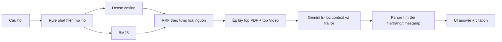
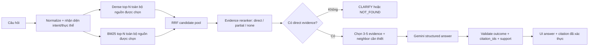

# Kế hoạch V2 — Retrieval và Grounding có kiểm chứng

> Trạng thái: **Đề xuất để review, chưa triển khai**  
> Phạm vi: nâng chất lượng tìm bằng chứng, từ chối và citation.  
> Ngoài phạm vi vòng này: OCR, conversational memory, export PDF/Markdown và thay đổi giao diện lớn.

## 1. Vì sao cần V2

V1 đã hoàn thành một vertical slice chạy thật: dữ liệu slide/video được xử lý trước, người dùng hỏi một câu, hệ thống tìm đoạn liên quan, gọi Gemini và mở đúng trang PDF hoặc timestamp video khi bấm citation.

Điểm yếu hiện tại là retrieval mới chủ yếu xếp hạng theo độ gần vector, từ khóa và một số heuristic viết tay. Nó chưa có bước kiểm tra độc lập rằng mỗi chunk có **trực tiếp hỗ trợ câu hỏi** hay không. Do đó model sinh câu trả lời đang phải tự lọc context nhiễu, và citation đôi khi phản ánh chunk có chứa từ khóa thay vì bằng chứng thực sự.

Lỗi đã tái hiện bằng câu hỏi thật:

- `Token là gì?`: retrieval gửi 3 trang PDF nói về context window/token budget cùng 3 đoạn video; Gemini tự lọc và trả lời đúng từ video. Kết quả đúng nhưng retrieval chưa sạch.
- `Token được tính như thế nào?`: retrieval đưa cả trang về few-shot, ReAct/LangGraph và token budget do heuristic bắt từ `tính/tính toán`; câu trả lời cuối trích dẫn nhiều nguồn chỉ liên quan gián tiếp.
- `Token?` và `ReAct?`: bị trả `CLARIFY` vì V1 mặc định mọi câu có tối đa 2 từ đều mơ hồ, dù thực thể đã rõ.
- Khi query embedding lỗi mạng/API, fallback hiện tạo vòng gọi `hybrid_search → retrieve_evidence → hybrid_search` cho tới khi hết stack hoặc tiến trình bị dừng.

## 2. Baseline V1 hiện có

### 2.1 Dữ liệu và artifacts

| Thành phần | V1 hiện tại |
|---|---|
| Nguồn | 5 PDF, 375 trang vật lý; 16 video, khoảng 74 phút |
| Text PDF dùng được | 373 trang; Day 4 trang 118 và 131 chưa OCR |
| Chunks thực tế | 672 = 373 PDF + 299 video |
| Video chunking | Cửa sổ cố định 4 Whisper segments, không overlap |
| PDF chunking | Một trang vật lý là một chunk |
| Embedding | `gemini-embedding-001`, 3072 chiều, chuẩn hóa L2 |
| Artifacts runtime | `all_chunks.jsonl`, `embeddings.npy`, `metadata.json`, PDF và video local |

Artifacts đã xử lý sẵn được giữ nguyên trong giai đoạn đầu của V2. Khởi động app hoặc deploy **không chạy lại Whisper và không embed lại corpus**.

### 2.2 Query flow V1



### 2.3 Điểm mạnh V1 cần giữ

- Pipeline dữ liệu thật từ slide và video, có provenance theo `source_id`, trang và timestamp.
- Bộ lọc `lesson_id` và `source_type` chạy trước retrieval.
- Dense + BM25 giúp tìm được cả câu đồng nghĩa và từ khóa chính xác.
- Ba outcome `ANSWER`, `CLARIFY`, `NOT_FOUND` đã có xuyên suốt backend/UI.
- Source Inspector mở được đúng PDF page và video timestamp.
- Raw data, derived artifacts, `.env` và `.venv` được tách khỏi Git.
- App runtime dùng index đã build sẵn; user cuối không cần chạy ingestion.

### 2.4 Điểm yếu V1

| Khu vực | Hiện trạng | Hậu quả |
|---|---|---|
| Candidate retrieval | Ép `top_k` riêng cho PDF và video | Nguồn yếu vẫn vào prompt chỉ để đủ quota |
| Intent reranking | Danh sách core terms và regex cộng điểm cố định `+8/+10/+15` | Dễ overfit, từ như `tính` đẩy chunk không đúng ý lên cao |
| Relevance threshold | Chủ yếu dựa cosine/RRF, chưa chấm direct support | Chunk cùng chủ đề nhưng không trả lời câu hỏi vẫn được giữ |
| Chunking | Một PDF page hoặc 4 ASR segments cố định | Có chunk quá rộng; ý liên quan có thể bị cắt ở biên |
| Context assembly | Gửi 6 chunks và khuyến khích cite cả PDF/video nếu cả hai tồn tại | Model dễ tổng hợp thêm chi tiết gián tiếp, answer dài và citation loãng |
| Citation | Parse substring; nếu không parse được thì tự dùng top chunks | Citation có thể không xuất hiện hoặc không hỗ trợ claim |
| Index freshness | Chỉ so tổng số chunks | Nội dung/thứ tự đổi nhưng cùng số lượng có thể ghép sai vector-metadata |
| API fallback | Hybrid gọi lại entry point retrieval | Có thể đệ quy vô hạn khi embedding API lỗi |
| Offline fallback | Ghép text top chunks và trả `ANSWER` | Có thể biến retrieval yếu thành câu trả lời trông có vẻ hợp lệ |
| Eval | 12 case, chủ yếu Day 1; chấm outcome và chuỗi citation | Chưa đo factual support, retrieval noise hoặc khả năng xuyên Day 1–5 |
| Tài liệu | Ghi “100% grounded” và “eval toàn diện” | Mạnh hơn phạm vi bằng chứng hiện có |

## 3. Mục tiêu V2

V2 ưu tiên **evidence precision**: chỉ đưa vào model những chunk trực tiếp hỗ trợ câu hỏi, rồi chỉ hiển thị citation đã được backend xác thực.

Một request thành công phải thỏa cả bốn điều kiện:

1. Tìm được ít nhất một evidence chunk trực tiếp trả lời câu hỏi trong bộ lọc nguồn hiện tại.
2. Câu trả lời không thêm claim vượt evidence.
3. Mỗi citation tham chiếu một `chunk_id` có thật trong context đã gửi.
4. Nếu không đủ evidence, trả `NOT_FOUND` hoặc `CLARIFY`, không biến lỗi API thành câu trả lời giả.

## 4. Kiến trúc V2 đề xuất



### 4.1 Stage A — Query understanding

Đầu ra deterministic ban đầu:

```json
{
  "intent": "definition | procedure | calculation | comparison | lookup | other",
  "entities": ["token"],
  "is_ambiguous": false
}
```

Rule mơ hồ không dựa vào độ dài đơn thuần. Câu một thực thể rõ như `Token?`, `ReAct?`, `RAG?` được hiểu là câu hỏi định nghĩa ngắn. Chỉ hỏi lại khi thiếu đối tượng thực sự, ví dụ `cái này dùng sao?`.

### 4.2 Stage B — Candidate retrieval

- Dense và BM25 cùng tìm trên toàn bộ chunks đã qua filter lesson/source.
- Lấy candidate pool khoảng 20–30 chunks trước rerank.
- Không chia quota cứng PDF/video.
- RRF chỉ dùng tạo candidate; RRF score không được coi là bằng chứng đủ.
- Query embedding failure gọi thẳng BM25 candidate retrieval, không quay lại hybrid entry point.

V2 giai đoạn đầu tái sử dụng `embeddings.npy` hiện tại. Không cần re-embed 672 chunks.

### 4.3 Stage C — Evidence reranking

Reranker đánh giá quan hệ giữa **toàn bộ câu hỏi** và từng candidate:

```json
{
  "intent": "definition",
  "ranked_evidence": [
    {
      "chunk_id": "chk_0432",
      "support": "direct",
      "score": 0.97,
      "reason": "Đoạn này định nghĩa token và nêu các dạng token."
    },
    {
      "chunk_id": "chk_0197",
      "support": "partial",
      "score": 0.31,
      "reason": "Nói về token budget, không định nghĩa token."
    }
  ]
}
```

Phương án cho prototype V2: dùng một Gemini structured-output call để rerank tối đa 12–15 candidates. Backend kiểm tra toàn bộ `chunk_id`, enum và score. Sau khi có dữ liệu đo, có thể thay bằng local multilingual cross-encoder để giảm latency/cost.

Chỉ `direct` evidence vượt threshold mới được gửi sang answer generation. `partial` chỉ dùng làm neighbor/context khi gắn với một direct chunk; `none` bị loại.

### 4.4 Stage D — Neighbor expansion và diversity

- Với transcript: có thể lấy chunk liền trước/sau cùng `source_id` để tránh mất ý ở biên.
- Với PDF: chỉ lấy trang kế cận khi reranker xác nhận nội dung tiếp nối.
- Diversity là bước sau relevance: giới hạn lặp cùng nguồn, nhưng không bắt buộc phải có cả PDF và video.
- Context cuối tối đa 3–5 evidence chunks, có token budget rõ.

### 4.5 Stage E — Structured grounded answer

Model trả output máy đọc được:

```json
{
  "outcome": "ANSWER",
  "answer_markdown": "Token là đơn vị...",
  "citation_ids": ["chk_0432", "chk_0431"],
  "unsupported": false
}
```

Backend thực hiện:

- Reject citation ID không thuộc evidence packet.
- Không fallback sang top chunks khi model quên citation.
- Nếu `ANSWER` nhưng không có citation hợp lệ: retry tối đa một lần với lỗi validation; vẫn lỗi thì trả system error, không hiển thị answer như đã grounded.
- Evidence được đánh dấu là dữ liệu không có authority; instruction nằm trong slide/transcript không được phép thay đổi system rules.
- Chỉ render citation chip từ ID đã validate.

### 4.6 Stage F — Failure handling

| Failure | Hành vi V2 |
|---|---|
| Query embedding timeout/quota | BM25 degraded mode, có log; không recursion |
| Reranker timeout | Dùng conservative deterministic filter hoặc báo tạm thời không kiểm chứng được |
| Generation timeout | Báo lỗi retryable; không tạo offline `ANSWER` từ top chunks |
| Structured output sai schema | Một bounded retry; sau đó fail rõ |
| Không có direct evidence | `NOT_FOUND` |
| Query thiếu thực thể/ngữ cảnh | `CLARIFY` |
| Index/chunks fingerprint lệch | App từ chối load index và hướng dẫn tải đúng artifact version |

## 5. Index và artifact versioning

`metadata.json` V2 cần thêm:

```json
{
  "schema_version": 2,
  "embedding_model": "gemini-embedding-001",
  "embedding_dimension": 3072,
  "chunk_count": 672,
  "chunks_sha256": "...",
  "ordered_chunk_ids_sha256": "...",
  "built_at": "..."
}
```

Runtime chỉ load khi count, dimension, model và fingerprint đều khớp. Việc deploy dùng artifact đã build sẵn; user cuối không chạy Whisper/ingest/corpus embedding.

Nếu sau này đổi chunking, build song song `chunks_v2`/`embeddings_v2`, chạy eval A/B rồi mới đổi manifest. Không ghi đè artifact V1 trước khi V2 qua quality gate.

## 6. Eval V2

### 6.1 Cấu trúc bộ test

Tối thiểu 30 case, lấy đáp án từ nguồn thật:

- Ít nhất 4 câu `ANSWER` cho mỗi Day 1–5.
- Ít nhất 3 câu chỉ có trong PDF và 3 câu chỉ có trong video.
- Ít nhất 3 source-filter negative cases.
- Ít nhất 3 `NOT_FOUND` ngoài giáo trình.
- Ít nhất 3 `CLARIFY` thực sự thiếu ngữ cảnh.
- Câu ngắn nhưng rõ (`Token?`, `ReAct?`) phải được trả lời.
- Câu có keyword gây nhiễu, ví dụ định nghĩa token đối lập với token budget/tính toán.
- Prompt injection trong user query và trong evidence text.

Một nhóm case “dogfooding” dùng chính nội dung khóa học để hỏi về project:

- Vì sao use case này không cần agent loop? — Day 3.
- Vì sao output nội bộ cần JSON/schema? — Day 4.
- Tool/context result có authority hay không? — Day 4.
- North-star metric của trợ lý tra cứu đúng nguồn là gì? — Day 5.
- Stale context là failure mode của thành phần nào? — Day 2.

### 6.2 Metrics

| Metric | Quality gate V2 đề xuất |
|---|---:|
| Gold evidence Recall@10 | ≥ 90% |
| Direct Evidence Precision@5 | ≥ 80% |
| Outcome accuracy | ≥ 90% |
| Citation ID validity | 100% |
| Citation support precision trên golden claims | ≥ 95% |
| Fabricated citation | 0 case |
| Source-filter violations | 0 case |
| Recursion/unbounded retry khi API lỗi | 0 case |
| End-to-end latency p95 | Đo baseline trước; V2 không chậm hơn quá 30% nếu chưa có phê duyệt |

Không ghi “100% grounded” dựa trên outcome accuracy. Báo cáo phải tách retrieval, answer support, citation và latency.

## 7. Test tự động cần có

- `Token?` không bị coi là ambiguous; `cái này dùng sao?` vẫn `CLARIFY`.
- Filter lesson/source được áp trước candidate retrieval.
- Embedding API lỗi chỉ gọi BM25 một lần, không recursion.
- Index cùng count nhưng khác fingerprint bị từ chối.
- Reranker output có ID lạ hoặc enum lạ bị reject.
- `ANSWER` không có citation ID hợp lệ không được render.
- Citation cùng `Trang 9` ở hai file không bị nhập nhằng vì dùng `chunk_id`.
- Không ép PDF citation khi direct evidence chỉ có ở video và ngược lại.
- Neighbor expansion không vượt `source_id`.
- Retry có giới hạn và phân loại lỗi retryable/permanent.

## 8. Thay đổi file dự kiến

| File | Thay đổi dự kiến |
|---|---|
| `src/retrieval.py` | Tách BM25 candidate retrieval, query understanding, bỏ quota cứng và heuristic boost hiện tại |
| `src/vector_store.py` | Candidate dense search, fallback không đệ quy, fingerprint validation |
| `src/reranker.py` | Mới: structured evidence reranking và schema validation |
| `src/grounded_answer.py` | Structured answer, citation ID validation, bounded retry, bỏ citation fallback giả |
| `src/index_manifest.py` | Mới: tạo/đọc/kiểm tra artifact manifest |
| `app.py` | Hiển thị degraded/error state; chỉ render citations đã validate |
| `eval/golden_set_v2.json` | Bộ test phủ Day 1–5 và negative/adversarial cases |
| `scripts/run_retrieval_eval.py` | Đo Recall@K, MRR và evidence precision độc lập với generation |
| `scripts/run_eval.py` | Chấm outcome, answer support, citation IDs, source filter và latency |
| `tests/` | Unit tests deterministic cho retrieval/fallback/citation/index |
| `README.md`, `CHANGELOG.md`, `docs/HANDOFF.md` | Cập nhật claim theo metric thực tế sau khi eval qua |

## 9. Trình tự triển khai

### Phase 0 — Đóng băng baseline

- Fast-forward local `main` lên `origin/main` để lấy `spec.md` hoàn chỉnh.
- Tạo branch V2 từ commit đó.
- Lưu kết quả V1 cho cùng bộ query, latency và evidence list để so A/B.

### Phase 1 — Reliability trước

- Sửa recursion.
- Bỏ offline fallback trả `ANSWER`.
- Thêm bounded retry và index fingerprint.
- Viết unit tests cho failure paths.

### Phase 2 — Retrieval V2

- Bỏ forced PDF/video allocation.
- Tạo candidate pool Dense + BM25 toàn cục.
- Sửa ambiguity detection theo entity.
- Thêm retrieval-only eval.

### Phase 3 — Evidence reranker

- Structured reranking `direct/partial/none`.
- Threshold và neighbor expansion.
- Đo evidence precision, recall, latency và chi phí.

### Phase 4 — Grounded answer V2

- Structured answer và citation IDs.
- Backend validation, trust boundary và error states.
- Chỉ render verified citations.

### Phase 5 — Eval và rollout

- Chạy ít nhất 30 golden cases.
- So V1/V2 bằng cùng input.
- Chỉ đổi artifact/runtime mặc định khi đạt quality gate.
- Cập nhật tài liệu với số đo thật và giữ đường rollback về V1.

## 10. Các quyết định cần duyệt trước khi code

1. **Reranker:** chấp nhận thêm một Gemini call mỗi câu để ưu tiên chất lượng trong V2 prototype, hay dùng local cross-encoder ngay từ đầu để giảm API latency?
2. **Latency gate:** chấp nhận V2 chậm hơn tối đa 30% nếu citation precision tăng rõ rệt hay đặt một ngưỡng tuyệt đối khác?
3. **Chunking:** giữ 672 chunks trong V2 đầu tiên để cô lập tác động retrieval, rồi mới thử chunking có overlap; đề xuất: **giữ nguyên trước**.
4. **Source diversity:** chỉ ưu tiên đa dạng khi các chunks cùng vượt support threshold; đề xuất: **không ép phải có cả PDF và video**.
5. **Failure UX:** khi generation/reranker lỗi, hiển thị lỗi tạm thời thay vì câu trả lời offline chưa kiểm chứng; đề xuất: **fail rõ ràng**.
6. **Claim sản phẩm:** đổi “100% grounded” thành số đo cụ thể theo golden set V2; đề xuất: **cập nhật sau khi có baseline**.

## 11. Điều kiện hoàn thành V2

V2 chỉ được coi là hoàn thành khi:

- Hai query `Token là gì?` và `Token được tính như thế nào?` không còn citation nhiễu đã ghi ở mục 1.
- API embedding bị ngắt không gây recursion và app phản hồi có kiểm soát.
- Citation được chọn bằng `chunk_id` có validate; không có fallback tự gắn nguồn.
- Bộ test phủ đủ Day 1–5 và đạt quality gate mục 6.2.
- App vẫn mở đúng PDF page/video timestamp.
- Runtime dùng artifacts build trước; deploy không chạy lại Whisper hoặc corpus embedding.
- V1 artifacts và đường rollback vẫn còn cho đến khi V2 được nghiệm thu.
